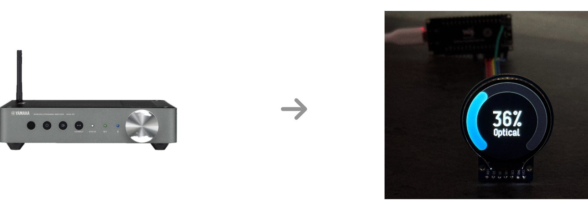

# MQTT-driven Virtual Volume Knob

There's a 99% chance this repository is not useful to you, just a heads up.

If you have a Home Assistant compatible amp/reciever but it doesn't have its own volume display for some reason, this
project lets you use an esp32 with an LCD as a virtual volume display for it.

It displays volume, current source, and power.

It's set up for an esp32c6 MCU + GC9A01 LCD at the moment, but the display is abstracted through mipidsi so it's
fairly straightforward to change either of the above.

